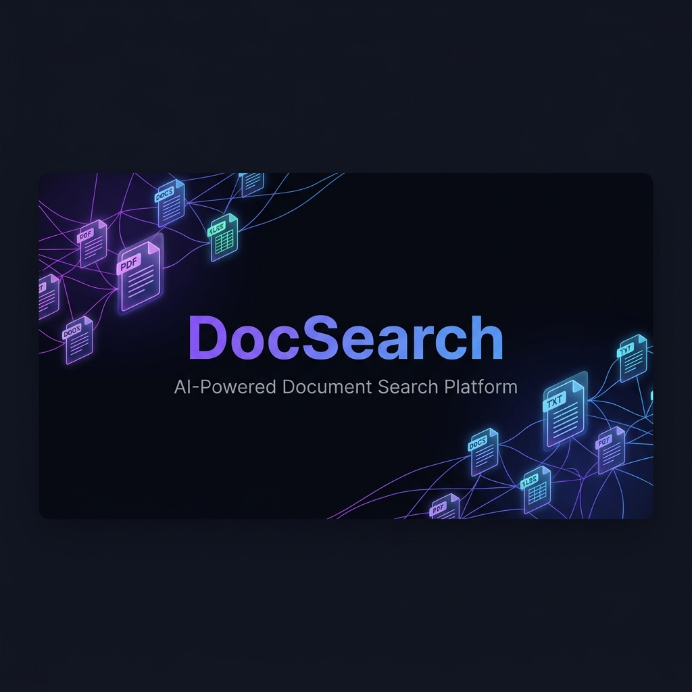
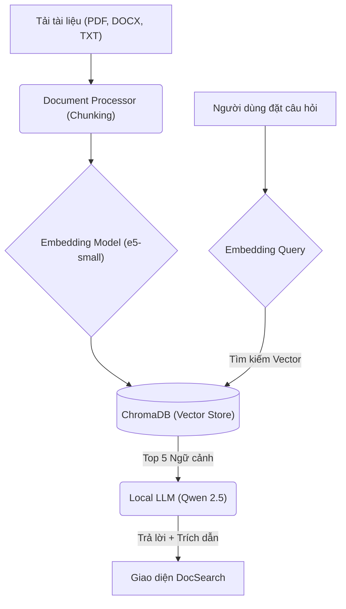

<div align="center">
  

  <h1 style="margin: 0; font-size: 2.5em; font-weight: 800;">DocSearch</h1>
  <p style="font-size: 1.2em; color: #7c5cfc;"><strong>A Next-Generation, 100% Offline AI Document Search Platform</strong></p>

  <p>
    <a href="https://fastapi.tiangolo.com/"></a>
    <a href="https://huggingface.co/Qwen"></a>
    <a href="https://www.trychroma.com/"></a>
    <a href="https://pytorch.org/"></a>
  </p>
  <p>
    <em>Xây dựng giải pháp RAG nội bộ bảo mật, mạnh mẽ & thông minh nhất cho doanh nghiệp của bạn.</em>
  </p>
</div>

---

## ⚡ Khám Phá Sức Mạnh Của DocSearch

DocSearch không chỉ là một công cụ tìm kiếm đơn thuần, mà là **trợ lý AI chuyên nghiệp** giúp "đọc hiểu" hàng ngàn trang tài liệu phức tạp và tổng hợp câu trả lời trực tiếp cho bạn. 

<table>
  <tr>
    <td width="50%">
      <h3>🔒 Bảo Mật Tuyệt Đối (Air-Gapped)</h3>
      <p>Hoạt động hoàn toàn nội bộ trên máy chủ/máy tính cá nhân. Mọi dữ liệu (từ PDF, Word đến câu hỏi của bạn) <b>không bao giờ</b> rời khỏi máy. Đảm bảo an toàn 100% cho bí mật kinh doanh.</p>
    </td>
    <td width="50%">
      <h3>🧠 Trí Tuệ SOTA (Qwen 2.5)</h3>
      <p>Sử dụng siêu mô hình Qwen 2.5 (1.5B) tinh chỉnh đặc biệt, cho khả năng sinh ngữ cảnh và suy luận tiếng Việt vượt trội, nhanh gọn và tối ưu hoá cho phần cứng cá nhân.</p>
    </td>
  </tr>
  <tr>
    <td width="50%">
      <h3>🎯 Trích Dẫn Minh Bạch</h3>
      <p>Mọi câu trả lời của AI đều đi kèm <b>Citations (Trích dẫn)</b> chi tiết. Bạn sẽ biết ngay thông tin được trích xuất từ <i>file nào, đoạn nào, sheet nào</i> kèm tỷ lệ khớp (Similarity Score).</p>
    </td>
    <td width="50%">
      <h3>💎 Trải Nghiệm Cao Cấp (Premium UI)</h3>
      <p>Giao diện siêu hiện đại, lấy cảm hứng từ các nền tảng công nghệ hàng đầu. Dark Theme tinh tế, Glassmorphism mượt mà và animation chau chuốt trên từng pixel.</p>
    </td>
  </tr>
</table>

## 📐 Kiến Trúc RAG Tiên Tiến

DocSearch áp dụng luồng xử lý RAG (Retrieval-Augmented Generation) chuẩn Enterprise, tối ưu hóa cả về tốc độ truy xuất và độ chính xác của ngữ cảnh:



## 🛠 Ngăn Xếp Công Nghệ (Tech Stack)

- **AI & NLP**: `PyTorch`, `Transformers`, `Sentence-Transformers`.
- **Vector Database**: `ChromaDB` (Lưu trữ và tìm kiếm vector không gian chiều sâu siêu tốc).
- **Backend API**: `FastAPI` & `Uvicorn` (Hiệu năng cao, xử lý bất đồng bộ).
- **Document Parsers**: `PyPDF2`, `python-docx`, `openpyxl`.
- **Frontend**: `Vanilla JS`, HTML5, CSS3 Variables (Không phụ thuộc framework nặng nề, tốc độ tải tức thì).

## 🖥 Yêu Cầu Hệ Thống

Để có trải nghiệm mượt mà và khai thác tối đa sức mạnh của mô hình GenAI cục bộ, hãy đảm bảo cấu hình hệ thống:

| Phần cứng | Cấu hình tối thiểu | Khuyến nghị (Dùng Mượt) |
|---|---|---|
| **OS** | Windows 10/11 / Linux | Ubuntu 22.04 / Windows 11 |
| **CPU** | Intel Core i5 / Ryzen 5 | Intel Core i7 / Ryzen 7 |
| **RAM** | 16 GB | 32 GB |
| **GPU** | Không bắt buộc (Chạy bằng CPU chậm) | **NVIDIA RTX 3060/4060 (6GB+ VRAM)** |

## 📊 Hiệu Năng Thực Tế (Benchmark)

Hệ thống đã được benchmark trực tiếp trên cấu hình **NVIDIA RTX 3060 (6GB VRAM)** chạy Local hoàn toàn:

- **Tốc độ sinh văn bản (LLM Qwen 2.5 - 1.5B)**: Đạt mức **~14.00 tokens/sec** ở định dạng `float16`. Đây là tốc độ rất mượt mà, tương đương tốc độ đọc của một người bình thường.
- **Tốc độ Embedding (multilingual-e5-small)**: Đạt **~17.62 ms** cho mỗi truy vấn tìm kiếm (Query), mang lại trải nghiệm phản hồi gần như tức thời.

---

## 🚀 Khởi Chạy Nhanh Trong 3 Bước

<details open>
<summary><b>Bước 1: Cài đặt môi trường</b></summary>

Di chuyển vào thư mục dự án và tiến hành cài đặt các thư viện lõi thông qua môi trường ảo (Virtual Environment).

```bash
# Di chuyển vào thư mục dự án
cd d:\chatbot

# Cài đặt môi trường ảo
python -m venv venv

# Kích hoạt (Windows)
venv\Scripts\activate

# Cài đặt toàn bộ thư viện yêu cầu
pip install -r backend/requirements.txt
```
</details>

<details open>
<summary><b>Bước 2: Chạy Server Backend</b></summary>

Khởi động lõi ứng dụng.
*(Lưu ý: Ở lần chạy đầu tiên, hệ thống sẽ tự động tải mô hình LLM và Embedding từ HuggingFace khoảng ~3.35GB vào cache. Các lần sau hoàn toàn chạy offline).*

```bash
python -m uvicorn backend.main:app --host 0.0.0.0 --port 8000
```
</details>

<details open>
<summary><b>Bước 3: Trải Nghiệm!</b></summary>

Mở trình duyệt web của bạn và truy cập ngay địa chỉ:  
👉 **[http://localhost:8000](http://localhost:8000)**

Kéo thả tài liệu từ ổ cứng và bắt đầu đặt câu hỏi!
</details>

---

## ⚙️ Tinh Chỉnh Nâng Cao (Configuration)

Bạn hoàn toàn có thể tùy biến cách hệ thống "đọc" và phân tích tài liệu để phù hợp hơn với loại văn bản đặc thù thông qua file `backend/config.py`:

```python
# Tối ưu hóa đặc tả cho ngôn ngữ Tiếng Việt
CHUNK_SIZE = 800          # Kích thước mỗi khung cắt văn bản
CHUNK_OVERLAP = 150       # Độ nối gối đầu để giữ luồng ngữ nghĩa (Context)
TOP_K = 5                 # Lấy ra 5 khối văn bản có liên quan nhất
SIMILARITY_THRESHOLD = 40 # Ngưỡng similarity tối thiểu để lọc thông tin rác
```

## 🤝 Giấy phép (License)
Dự án được phân phối dưới giấy phép mở. Bạn hoàn toàn tự do sử dụng, chỉnh sửa, nâng cấp và áp dụng cho nội bộ công ty.

---
<p align="center">
  <i>Được xây dựng với sứ mệnh đem sức mạnh AI an toàn, riêng tư đến với mọi tổ chức Việt Nam.</i>
</p>
